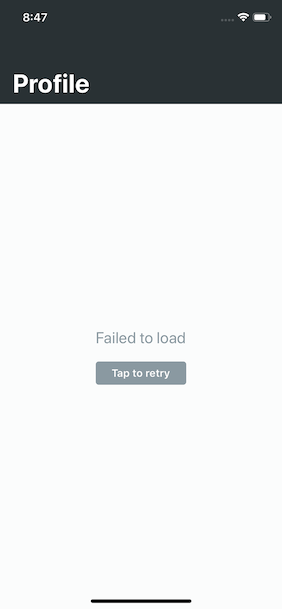

# Tech task. Ciklum

## A simple app, which:
- loads data from https://api.randomuser.me/ endpoint, parses it and renders
- shows loading indication
- shows error message and allows user to retry in case of request failed
- uses AutoLayout to correctly show data on all possible screens

## The app should work properly:
- on devices iPhone 5s and newer
- in portrait and landscape mode

>Loading indicator and Error message

>Success loaded data

Made with 🖤 by <a href="https://github.com/MikaelMelkonyan">Mikael Melkonyan</a>

